<!-- ══════════════════════════════════════════════════════════════════
     YUG PATEL · DARK CYBER PORTFOLIO v4 — CONNECTED HUD EDITION
     Direction: Superdesign draft "CyberHUD Profile Section Headers"
       (project 420732f3, draft 6feb933f) + ui-ux-pro-max OLED dark
       + premium-frontend-ui hero architecture + brutalist telemetry accents
       + GSAP timeline thinking → SMIL (staggered begin offsets, sweeps)
     v4: one connected cyber interface — angular HUD panels, circuit-trace
       dividers with data packets, perspective grid + noise + radar hero,
       local frame-top/frame-bottom replace all third-party banners.
     Render-safe policy (verified 2026-07-15):
       · ALL frames/headers/dividers = local animated SVGs in assets/
         — served by GitHub itself, cannot 404
       · readme-typing-svg.demolab.com — HTTP 200 ✓
       · img.shields.io — HTTP 200 ✓
       · capsule-render.vercel.app — REMOVED (replaced by local frames)
       · github-readme-stats — HTTP 503 ✗ BANNED. No stats cards.
     ══════════════════════════════════════════════════════════════════ -->

<div align="center">


<!-- LOCAL ANIMATED HERO — lives in this repo, can never break -->
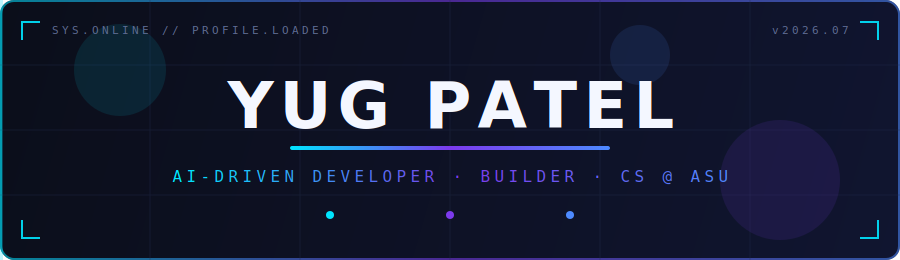

<br/><br/>

[](https://github.com/YugPatel8-git)

<br/>

&nbsp;&nbsp;

</div>

<div align="center"></div>


<!-- ─── SYS.01 · IDENTITY ─────────────────────────────────────────── -->


<div align="center"></div>
<div align="center">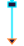</div>


<table>
<tr>
<td width="55%" valign="top">

<br/>

**Yug Patel** — Computer Science student at **Arizona State University** and **Technical Consultant at ASU**, solving real technical problems for real people every week.

I'm an **AI-driven developer**: agentic tooling handles planning, design direction, testing, and review inside my everyday loop — so I can focus on shipping software that actually gets used.

</td>
<td width="45%" valign="top">

```yaml
focus:
  - AI & agentic workflows
  - software engineering
  - frontend / UI
  - data & automation
principle: >
  build practical tools,
  degrade gracefully,
  ship on purpose
```

</td>
</tr>
</table>

<div align="center">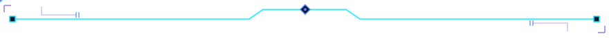</div>

<!-- ─── SYS.02 · ACTIVE.PROCESSES ─────────────────────────────────── -->

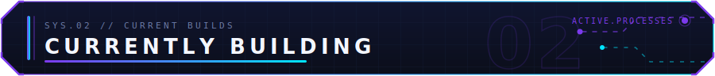

<div align="center">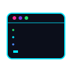</div>
<div align="center"></div>


<div align="center">
<br/>

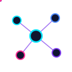


</div>

<div align="center"></div>

<!-- ─── SYS.03 · PROJECT.INDEX ────────────────────────────────────── -->


<table>
<tr>
<td colspan="2" valign="top">

### ⚽ Stat Updates · 

> Soccer **live-match dashboard** on real football APIs — live scores, team logos, match analysis views, and caching engineered to stay fast *and* inside API rate limits. If data can break, it degrades gracefully.

    

</td>
</tr>
<tr>
<td width="50%" valign="top">

### 🤖 Local AI Assistants

> Experiments running AI assistants **locally** and wiring them into real everyday workflows — not one-off chats.

 

</td>
<td width="50%" valign="top">

### ⚙️ Automation & Dashboards

> Scripts and dashboards that erase repetitive work and surface useful data where it's actually seen.

 

</td>
</tr>
</table>

<div align="center"></div>

<!-- ─── SYS.04 · AGENT.LOOP ───────────────────────────────────────── -->

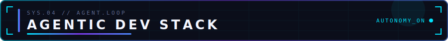

<div align="center">
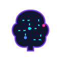
<div align="center"></div>
<br/>
&nbsp;&nbsp;&nbsp;&nbsp;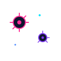&nbsp;&nbsp;
<br/><sub><code>DEFENSE GRID // agent guardrails: sandbox, review, verify</code></sub>
</div>


<sub>Tools and workflows I **use or explore** in my AI-assisted development loop — not tools I built.</sub>

| Phase | Tool | Role in my workflow |
|:---|:---|:---|
| `DESIGN` | **Superdesign** | AI-assisted UI direction before writing frontend code |
| `PLAN` | **Superpowers** | Plan-first Claude Code workflow |
| `SECURE` | **Trail of Bits skills** | CodeQL / Semgrep / static-analysis mindset |
| `EDIT` | **Karpathy skill** | Surgical, minimal code changes |
| `VERIFY` | **Playwright MCP** | Browser testing & click-through validation |
| `REMEMBER` | **Memory MCP** | Persistent project memory across sessions |
| `RESEARCH` | **NotebookLM MCP** | Second-brain research & project notes |
| `LOG` | **CLAUDE.md decision log** | Wrap-ups, decisions, and next steps per repo |
| `DISCOVER` | **find-skills** | Skill discovery & tool selection |

<div align="center"></div>

<!-- ─── SYS.05 · STACK.MANIFEST ───────────────────────────────────── -->

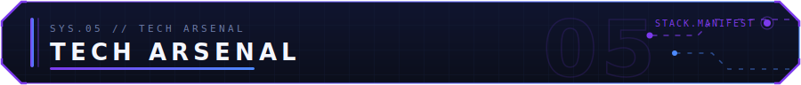

<div align="center">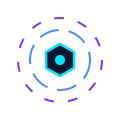</div>
<div align="center"></div>


| Layer | Tools |
|:---|:---|
| **Languages** |      |
| **Frontend** |     |
| **Data & Tools** |      |

<div align="center"></div>

<!-- ─── SYS.06 · UPGRADE.QUEUE ────────────────────────────────────── -->


<div align="center">
<br/>


</div>

<div align="center"></div>

<!-- ─── SYS.07 · TELEMETRY ────────────────────────────────────────── -->

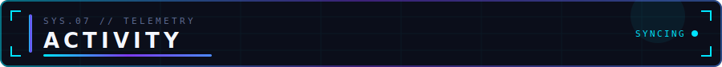

<div align="center">
<br/><sub><code>SCAN: public repos // signal live</code></sub>
</div>

<table>
<tr>
<td align="center" width="33%"><br/>🔭<br/><b>SHIPPING</b><br/><br/><sub><b>Stat Updates</b> — iterating on live data, caching & match analysis</sub><br/><br/></td>
<td align="center" width="33%"><br/>🧪<br/><b>EXPLORING</b><br/><br/><sub>Local AI assistants & agentic development workflows</sub><br/><br/></td>
<td align="center" width="33%"><br/>🌱<br/><b>SHARPENING</b><br/><br/><sub>Applied AI/ML · TypeScript · frontend architecture · data & APIs</sub><br/><br/></td>
</tr>
</table>

<div align="center">
<sub>No auto-generated stats cards — they break. The real signal lives in the repos ↓</sub>

<br/><br/>

<a href="https://github.com/YugPatel8-git?tab=repositories"></a>
</div>

<div align="center"></div>

<!-- ─── SYS.08 · UPLINK ───────────────────────────────────────────── -->


<div align="center">

</div>

<div align="center">
<br/>

**Let's build something together** — AI tools, web apps, or automation ideas welcome.

<a href="mailto:yugkpatel872006@gmail.com"></a>
&nbsp;
<a href="https://github.com/YugPatel8-git"></a>
&nbsp;
<a href="https://github.com/YugPatel8-git?tab=repositories"></a>

<br/><br/>

<sub><code>BUILD USEFUL THINGS · SHIP THEM · REPEAT</code></sub>


</div>

<div align="center"><sub><code>LAST SYNC: 2026-07-15 // SIGNAL STABLE</code></sub></div>
